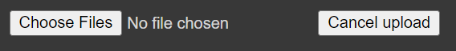
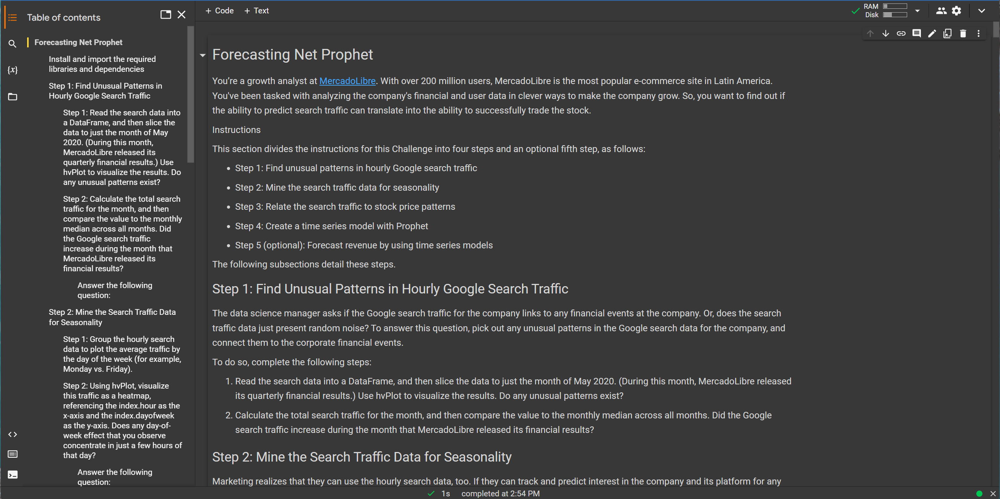
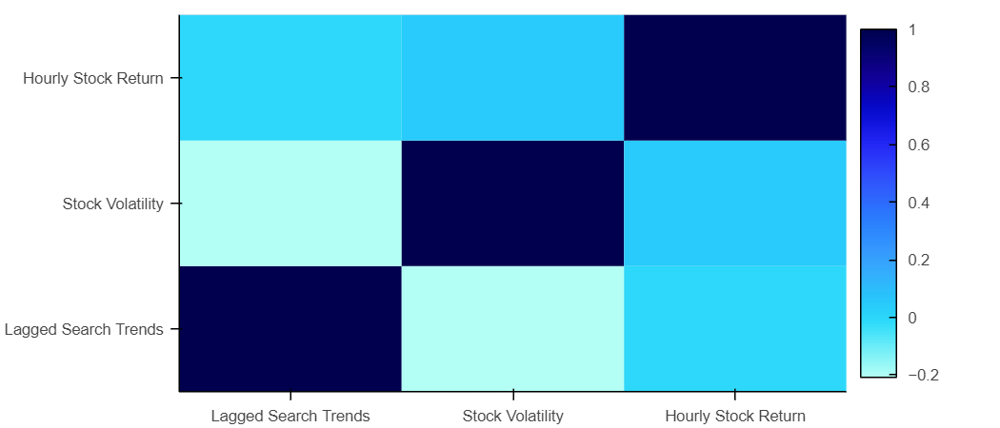
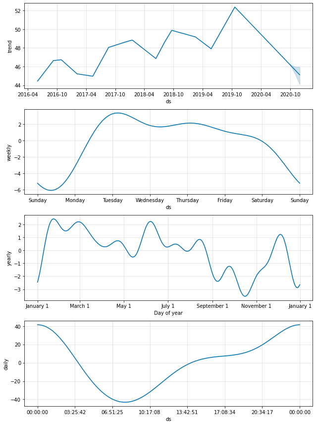

# Data Mining Search Trends : MercadoLibre Case Study 

<div class="row">
  <div class="column">
      
    
    </div>
</div>


> Data-mining MercadoLibre Google Search Trends and stock performance to find seasonal patterns, weekly trends, correlations, and future projections using Facebook Prophet.


---
## Technologies

This project is written using a ```Jupyter Lab``` notebook running in a Google Colab runtime environment (https://colab.research.google.com/).  For plot visualizations,```hvplot``` in a  ```holoviews``` extension  is used for plotting the line curves, bar plots, and heat maps.  [Facebook Prophet](https://facebook.github.io/prophet/) is used for making forecast projections and exploring seasonality trends.

---

## Installation Guide

Since the ```jupyter```notebook ```forecasting_net_prophet.ipynb``` is to be run in a Google Colab runtime environment, no local installations are needed. 

However, the required libraries and dependencies need to be installed and imported into the Google Colab runtime environment.  

Navigate to Google Colab at: [https://colab.research.google.com/](https://colab.research.google.com/).
Open the jupyter notebook: ```forecasting_net_prophet.ipynb```.

To install the required libraries, run the second cell of the notebook:
```python
# Install the required libraries
!pip install pystan
!pip install fbprophet
!pip install hvplot
!pip install holoviews
```

Import the required libraries and dependencies by running the third cell of the notebook:
```python
# Import the required libraries and dependencies
import pandas as pd
import holoviews as hv
from fbprophet import Prophet
import hvplot.pandas
import datetime as dt
import numpy as np
%matplotlib inline
```

The resource data files also need to be uploaded to the runtime environment.  These uploads are performed in cell blocks ```[4]``` and ```[37]```.  After running each of these cells, you must select the 'Choose Files' button, which appears below the cell after running:

.

From your local repository, select ```google_hourly_search_trends.csv``` for cell block ```[4]``` and select ```mercado_stock_price.csv``` for cell block ```[37]```.


The report and analysis are performed in the remaining portions of the Jupyter notebook and all cells can be run sequentially after all the uploads are complete.  

---

## Usage

To view the jupyter notebook used in this analysis, open the ```forecasting_net_prophet.ipynb``` file in a Google Colab environment at [https://colab.research.google.com/](https://colab.research.google.com/).

The notebook should look like the screenshot below:


## Results

This Jupyter notebook performs an extensive time series analysis on the Google Search Trends on MercadoLibre.  Using the hourly Google Search Trends downloaded from Google trends, the analysis uncovers:
* Highest Periods of Daily/Hourly Search Traffic


* Highest Periods of Weekly Search Traffic


* Correlations of Traffic with Stock Price


* Future Projections of Search Traffic using Facebook Prophet


## Data Sources

The MercadoLibre Google search and stock data used in this report can be found in the Resources directory: ```./Resources/google_hourly_search_trends.csv``` and ```./Resources/mercado_stock_price.csv```.  The data is provided by the course materials from a UCBerkeley Fintech Extension program.  

---

## Contributors

The seed code is from the course material from a UCBerkeley Extension program.  This analysis is written and performed by John Gruenewald.<br><br>
For more information, contact **John Gruenewald**:<br>
**e-mail:** [john.h.gruenewald@gmail.com](mailto:john.h.gruenewald@gmail.com)<br> **linked-in:**  [jhgruenewald](https://www.linkedin.com/in/jhgruenewald/)<br>**twitter:**  [@GruenewaldJohn](https://twitter.com/GruenewaldJohn)<br>**medium:**  [@comput99](https://medium.com/@comput99)

---

## License

MIT License

Copyright (c) 2022 John Gruenewald